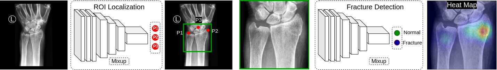

# Paper Link 
Title: Deep Learning for Wrist Fracture Detection: Are We There Yet? <br />
[arXiv link](https://arxiv.org/abs/2012.02577) 

# DeepWrist Pipeline
A transfer learning pipeline to detect wrist fracture from DICOM files. It has two blocks: Landmark Localization Block 
and Fracture Detection Block.



Both of the blocks are yml configuration based. We used OmegaConf for this purpose. Each executable python file can 
either run standalone or requires a yml file as `experiment` argument to be passed down at command line. 

## Landmark Localization Block 
Landmark Localization Block is adapted from [KNEEL](https://arxiv.org/pdf/1907.12237). However, we developed some data 
augmentation methods suited to our task.  The `localizer` folder contains the source code for Landmark Localizer and 
structured as <br />
```
localizer 
|---config 
|   |---experiment
|---kneel_before_wrist 
|   |---data 
|   |---model 
|---scripts 
```
The `config` folder contains the initial default configuration and a configuration processor. There is a folder named 
`experiment` inside `config` folder which holds confgiguration for different experiments. 

`kneel_before_wrist` hosts the body of the localizer part of our pipeline. It has two sub-directory: `data` and `model`. 
The `data` folder contains utilities necessary to process and augment data for training and evaluation. `model` 
sub-directory contains the pytorch lightning version of HourGlass network which we will use for training the localizer. 

The `scripts` directory hosts all the experiment scripts for which the yaml configurations are created. 


## How to Train Localizer with your own data 
1. First step for training your own localizer is to collect data. For our research we used private hospital data, 
threfore it cannot be shared. To make things simple, we used csv file to store meta data about the dataset. This way, 
you don't have to load the full dataset to the memory rather fecth the file location from csv file and read it just-in-time.
So, we are dealing with wrist fracture images. We will consider posterioanterio (PA) and lateral (LAT) view of the wrist x-ray. To 
make your own dataset, you have to create a csv metadata file containing  at least `Fname, Points,  Side` columns. `Fname` 
is the absolute path to the wrist image, `Points` column will contain the landmark coordinates of top of distal ulna, 
top of distal radius and assumed center of the wrist for PA view and two distinguishalbe points on top part of distal
radio-ulna bone and the assumed center of wrist for LAT view. As the name suggest, the `Side` column contains the side 
information of corresponding wrist x-ray. Put 0 for PA and 1 for LAT. Once the metadata is ready, we can move forward. 

2. Second step is to clone `wrist_landmark.yaml` configuration file and modify the clone. Inside the yaml file modify 
following 
```
  data_home: # root folder that contains the data folder 
  data_folder: # your data folder name
  meta: the csv meta file you have created. should be inside data folder 
```
3. Once you are done with step 2, run the `train_ptl.py --experiment=YourClonedYAMLFile`. This file is located inside 
`scripts` folder. It will start the training. 

## Fracture Detection Block
The `classifier` folder hosts the Fracture Detection Block. It has a similar structure like localizer. 
```
classifier 
|---config 
|---fracture_detector
|   |---callback 
|   |---data 
|   |---model 
|---script 

```

Like before `config` folder hosts the script configurations. `fracture_detector` folder hosts necessary folders and
files for model, data and training related stuffs. Inside this folder, there are three folders: 1) `callback` (hosts 
callback function definitions), 2) `data` (hosts data related utilities) and 3) `model` (hosts model definition and
training methods)


## How to train your Fracture Detector 
Step 1. First step to train your custom fracture detector is to collect data using the `localizer` model trained previously. 
Save the generated ROI with the corresponding `ID` as filename. Create a csv metadata file with `ID`, `Side`, `Fname`(optional) 
and `Fracture` columns. Say, the meta file name is `your_meta.csv`Create a `root` folder which we will use as data home where the generated ROI images and the csv 
meta file are saved. There shoudl be `PA` and `LAT` folder in the `root` folder to host PA ROI and LAT ROI respectively. 

Step 2. Clone the existing training conf `fracture_detector_seresnet.yaml` to `your_config_file.yaml`. 
Open `your_config_file.yaml` and update the following field
``` 
data_home: root
meta: your_meta.csv
``` 
Step 3. Once you are done with the config file go inside the `scripts` folder and run `python train_ptl.py experiment=your_config_file`. 
this will start the training.

## Inference on your Data 
Step 1. Create a csv meta file of for the data you want to predict. Use `ID`, `Side`, `Fname`, and `Fracture` columns. 

Step2. Clone `fracture_deteciton_testset_1.yaml` to `your_testset.yaml`

Step 3. Find and update the following field in `your_testset.yaml`
``` 
dataset:
  train_data_home: root
  test_data_home: /location/of/test/data
  meta: /absolute/location/to/your_testset.csv
save_path: /absolute/location/to/save/prediction.csv
snapshot_folder: /folder/location/where/fracture/detector/models/are/saved
save_image: true or false
save_image_dir: /folder/location/if/you/want/to/save/output/images

localizer:
  snapshot_folder: /folder/location/where/roi/localizer/models/are/saved
  dataset:
    train_data_home: /folder/location/where/localization/data/are/stored
``` 
keep only `Fracture` in `gt`. If you want to save gradcam set `save_gradcam: true` and define `gradcam_dir`

Step 4. Now in the `scripts` folder run, `python test.py experiment=your_testset`
This will do inference on your data, the predicitons will be saved in the csv file you defined. 


## 
# Trained Models 
Use the following commands to get the trained models. 
``` 
wget http://mipt-ml.oulu.fi/models/DeepWrist/Fracture_Detection_Block.tar.gz
wget http://mipt-ml.oulu.fi/models/DeepWrist/ROI_Localization_Block.tar.gz
```
# How to Cite
For citation, please use the following bibtex 
``` 
@misc{raisuddin2020deep,
      title={Deep Learning for Wrist Fracture Detection: Are We There Yet?}, 
      author={Abu Mohammed Raisuddin and Elias Vaattovaara and Mika Nevalainen and Marko Nikki and Elina Järvenpää and Kaisa Makkonen and Pekka Pinola and Tuula Palsio and Arttu Niemensivu and Osmo Tervonen and Aleksei Tiulpin},
      year={2020},
      eprint={2012.02577},
      archivePrefix={arXiv},
      primaryClass={cs.CV}
}
```